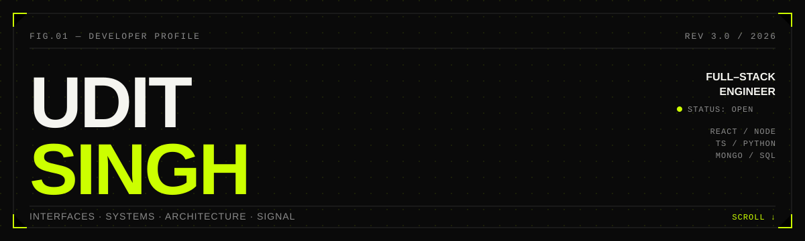
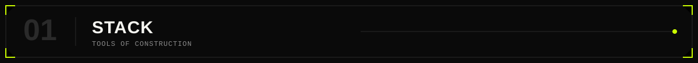
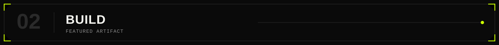
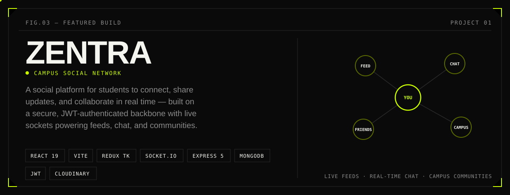
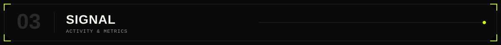
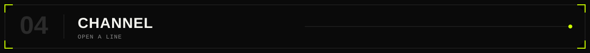
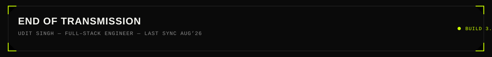

 

 

 

<table width="100%" border="0" cellspacing="0" cellpadding="8">
<tr>
<td width="33%" valign="top">

**`A — INTERFACE`**

React · Next.js · TypeScript · JavaScript · Tailwind

</td>
<td width="33%" valign="top">

**`B — SYSTEM`**

Node.js · Express · Python · FastAPI · MongoDB · MySQL

</td>
<td width="33%" valign="top">

**`C — WORKFLOW`**

Git · GitHub · Linux · Postman · VS Code · Figma

</td>
</tr>
</table>

 

 

 

 

<table width="100%" border="0" cellspacing="0" cellpadding="6">
<tr>
<td width="50%"></td>
<td width="50%"></td>
</tr>
</table>

  

 

 

&nbsp;
&nbsp;
&nbsp;

  

 

