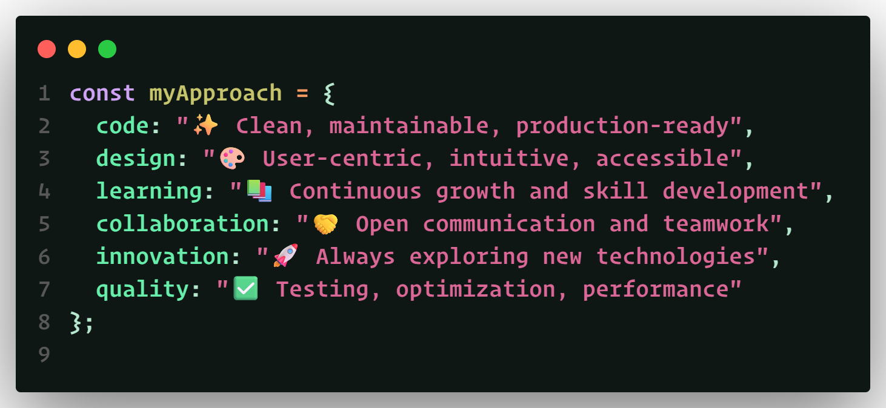

# ⟬⟬ 𝗨𝗗𝗜𝗧 𝗦𝗜𝗡𝗚𝗛 ⟭⟭ ⊹ 𝓬𝓸𝓭𝓮 ⟡ 𝓬𝓻𝓮𝓪𝓽𝓮 ⟡ 𝓲𝓷𝓷𝓸𝓿𝓪𝓽𝓮 ⊹

&nbsp;&nbsp;

---

## ⚡ Into the Lab
**Step into the lab where ideas take shape and code becomes creation.** 
> I’m **Udit Singh** — crafting the web as a living canvas.  
Interfaces that feel alive. Backends that never falter. Systems that scale like thought.  
Here, logic dances with imagination; every line of code pushes boundaries.  
Dive in—explore where **vision transforms into digital reality**.

 

---
 

## 🌐 Connect With Me

 

---
 

## 🛠️ Tech Stack

### 🎯 Frontend

### 🔧 Backend

### 🚀 DevOps & Tools

---
 

## 🎪 Featured Project

### 🧭 Zentra — Real-Time Social Collaboration Platform

> Real-time platform for **team collaboration and live document editing**.

**Tech Stack:** React, Node.js, MongoDB, Tailwind, Docker

---
 

## 💭 My Development Philosophy

  

---
 

## 📊 GitHub Analytics

---
 

## 🎯 Contribution Activity

---

**🎯 Let's Build Something Extraordinary Together!**

────────── 𝓥𝓮𝓻𝓼𝓲𝓸𝓷 2.0 ──────────

⚡ 𝓤𝓭𝓲𝓽 𝓢𝓲𝓷𝓰𝓱 ⚡ Last Update: Oct ‘25

